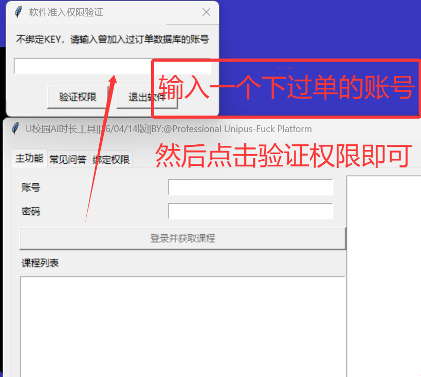
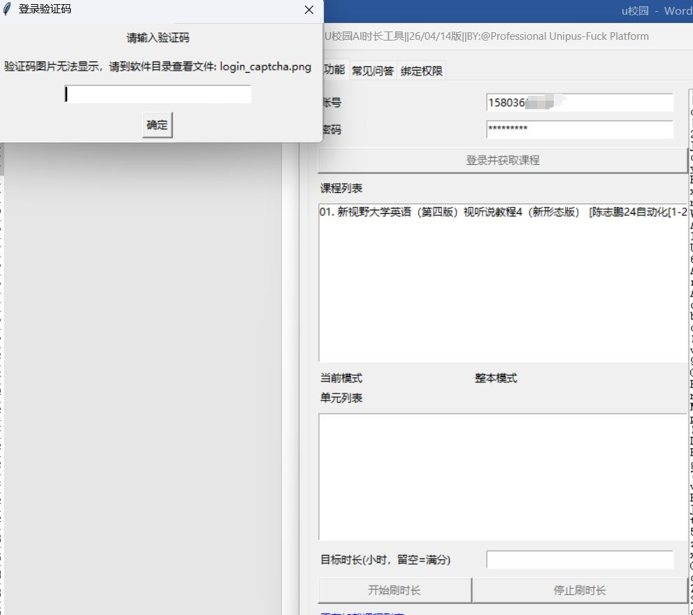
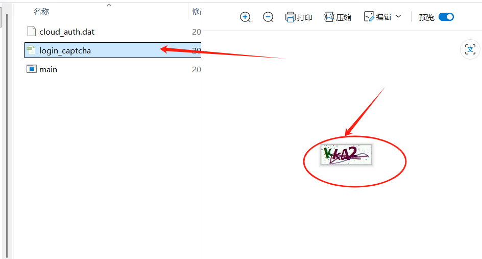
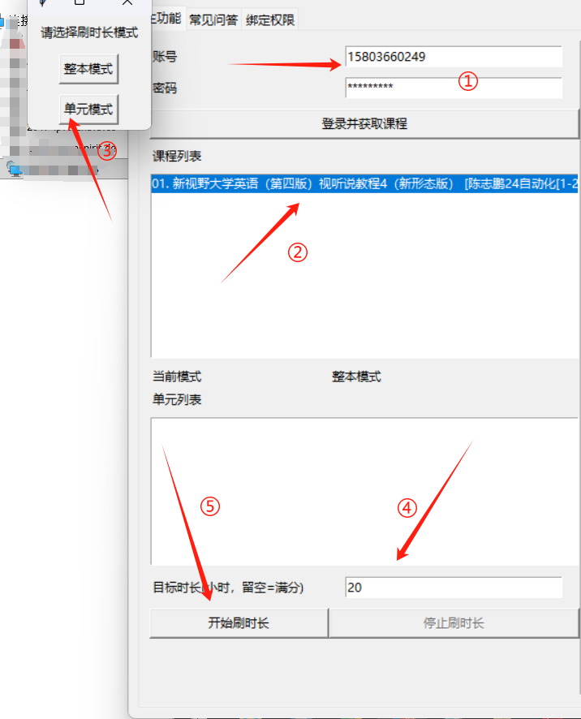
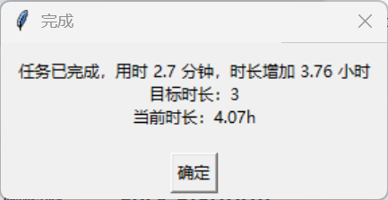
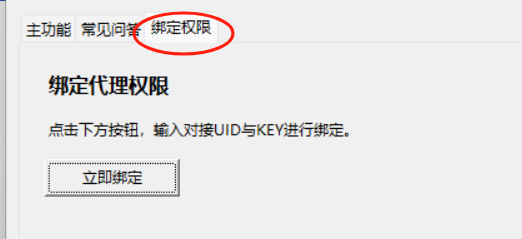

# U校园时长工具使用说明

## 工具使用指导

请使用 **Windows 电脑** 下载软件 `.zip` 压缩包并解压。  
解压完成后，双击 `main.exe` 即可运行。

---

## 一、基本使用流程

### 1. 首次使用与权限验证

如果软件提示需要验证权限，请先输入一个**已下过单的账号**，然后点击**验证权限**即可。

### 2. 登录与验证码说明

登录时如果弹出验证码窗口，按提示处理即可。  
如果窗口内无法直接显示验证码图片，请到软件目录中打开 `login_captcha.png` 查看验证码内容，再手动输入。

登录成功后，程序会显示当前账号下可用的课程列表。你可以根据实际需要选择：

- **整本模式**
- **单元模式**

> 注意：只有在 **PUP 接口下过单** 的账号，才可以正常使用本程序。  
> 未下单账号不支持使用。

### 3. 操作步骤

1. 输入已经提交到 **PUP 平台** 的账号信息。  
2. 选择需要处理的对应课程。  
3. 根据需要选择 **整本模式** 或 **单元模式**。  
4. 输入目标时长，单位为 **小时**。  
5. 点击 **开始刷时长**，然后耐心等待即可。

#### 目标时长说明

这里填写的是**目标时长**，不是在当前基础上继续叠加的时长。

例如：

- 当前课程时长为 `10h`
- 输入目标时长 `20`
- 最终时长会刷到 **20h 左右**

也就是说，程序会把时长补到目标值附近，而不是在现有 `10h` 的基础上再额外增加 `20h`。  
如果留空，则默认按**满分目标**处理。

#### 速度说明

实际速度大约为：**5 分钟增加 20h 左右**。  
具体效果请根据实际环境自行测试。

### 4. 完成提示

当程序弹出如下提示时，表示本次任务已经完成。

---

## 二、UID / Key 与代理权限说明

如果绑定 `uid` 和 `key` 成功，则默认拥有**代理权限**，此时不限制账号来源，任何账号都可以增加时长。

如果**没有代理权限**，则只能为**我方数据库中出现过的账号对应课程**增加时长。

> 只有**源台用户**才有 `uid` 和 `key`。  
> 如果你没有源台账户，可以直接忽略这一项。

### 绑定入口示意

---

## 三、使用范围说明

只有在平台**下单过**的课程，才可以使用本软件增加时长。

### 示例 1

账号 1 下存在两本书：

- 新视野大学英语（第四版）视听说教程 4
- 新视野大学英语（第四版）读写教程 4

如果你只下单了**视听说 4**，那么本程序**只能用于增加视听说 4 的时长**，不能用于增加**读写 4** 的时长。

### 示例 2

账号 2 存在《新视野大学英语（第四版）读写教程 4》这本书。

如果你只下单了**第一单元**，则本程序**只能用于增加第一单元的时长**，不能用于增加第二单元或其他单元的时长。

### 总结原则

> **下单了才可以使用。**

也就是说，本程序始终只支持对**已下单的课程或单元**增加时长。

### 为什么下单后还需要额外增加时长？

原因通常有这几种：

- 你可以只下单**做题项目**，再使用本程序单独增加时长；
- 即使订单包含时长，通常也只是补到**满分要求**；
- 如果课程满分要求为 `20h`，并且当前已经达到 `20h`，继续重刷通常也不会再增加；
- 这时如果你还需要额外增加时长，就可以使用本软件继续处理。

---

## 四、常见问题

### Q1：登录后提示失败怎么办？
**A：** 先确认账号密码是否正确，再检查当前网络是否可以正常访问 U校园相关域名；如果频繁失败，建议等待几分钟后再重试。

### Q2：为什么会弹出验证码？
**A：** 当平台触发风控时，会要求输入验证码。按提示输入即可，输入后程序会继续执行。

### Q3：日志里显示 IP 被拉黑怎么办？
**A：** 建议切换网络环境，例如重启路由器，或者使用手机热点并开启飞行模式约 5 秒后再关闭。恢复后重新登录即可。

### Q4：单元模式和整本模式有什么区别？
**A：**
- **整本模式**：按课程整体处理；
- **单元模式**：只处理你勾选的单元。

### Q5：可以设置目标时长吗？
**A：** 可以，在“目标时长”中输入小时数即可；如果留空，则按满分目标处理。

### Q6：程序什么时候会自动停止？
**A：** 启动后，程序会每 **30 秒** 检测一次实时时长；达到目标后会自动停止所有任务。

### Q7：点击开始后，短时间卡顿是否正常？
**A：** 正常。程序启动初期会进行初始化和网络握手，一般会在 **30 秒左右** 恢复。

### Q8：软件无法使用通常是什么原因？
**A：** 请优先关注频道并下载最新版本，旧版本可能已经失效或不再兼容。

### Q9：为什么提示“鉴权失败，无代理权限且未加入数据库”？
**A：**
- 如果绑定 `uid` 和 `key` 成功，则默认拥有代理权限，不限制账号来源；
- 如果没有代理权限，则只能使用数据库中已有记录的账号对应课程。

---

## 补充说明

为保证使用效果，建议尽量保持以下条件：

- 网络环境稳定
- 使用最新版程序
- 账号、课程、权限范围与下单内容一致

如遇到异常情况，可优先检查以下几项：

1. 账号密码是否正确  
2. 是否触发验证码  
3. IP 是否异常  
4. 是否属于已下单课程或单元  
5. 当前版本是否为最新版本
